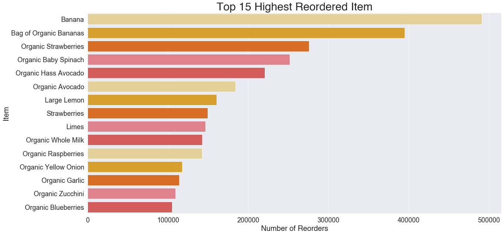
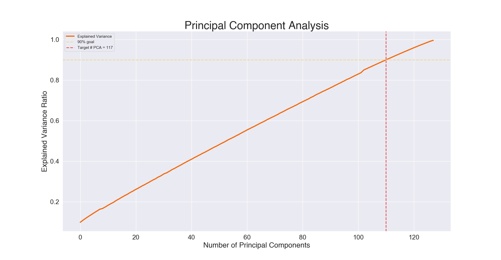

- Instacart partners with most supermarkets, and some local speciality shops depending on your area. Once you place an order a "personal shopper" will fulfill and deliver your order to your door on the same day
- This dataset is made up of 3 million food orders from about 120,000 customers from the company spanned across multiple CSV files

## Customer Information

## Principal Components
- The data frame was organized by users and the number of purchases by aisle. By exploring PCA we can see how many features this matrix can be reduced down by.
- Realizing that there needs to be 117 features (instead of our original 134) to account for 90% variance in the model tells us that the features are already orthogonal (or pretty close) and won't help us limit our features.
- Moving on!

## Supervised Machine Learning
- Can I predict if your order has the number one ordered item - Bananas! By only looking at the day and time of order, the number of days since your last order, and the number of items in our order?
- Even though it is the most purchased item with over 500,000 orders, we are dealing with imbalanced classes, only 26% of orders have bananas
- Many attempts were made to adjust this imbalance, lets look at the progession of scores over different models
    - Decision Tree
    - RF Basic = Random Forest with 50 trees
    - RF Best Param = Random Forest with 80 trees, max depth of 4 and max features of 3, and min samples split of 4
    - RF Class Weights = Same as Best Param but found the weights of each group and used that in class weights 

## Unsupervised Machine Learning

#### Credits
*"The Instacart Online Grocery Shopping Dataset 2017” Accessed from [here](https://www.instacart.com/datasets/grocery-shopping-2017) on August 20th, 2020*
