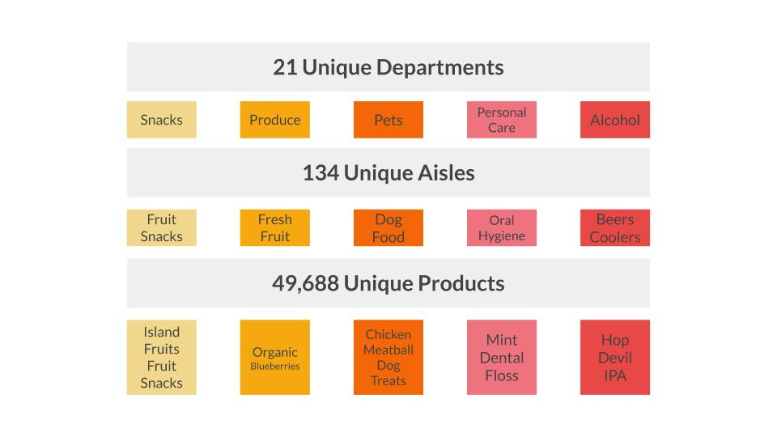
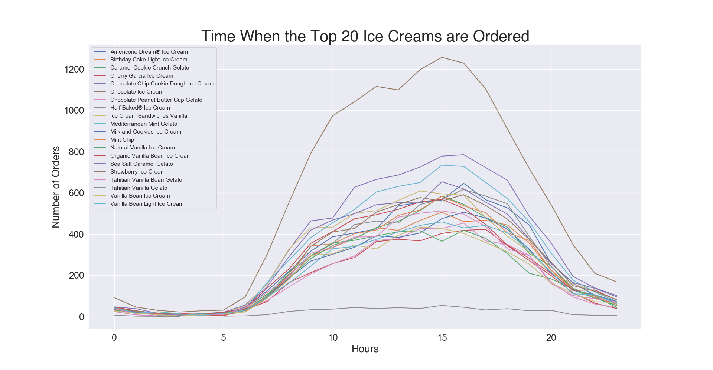
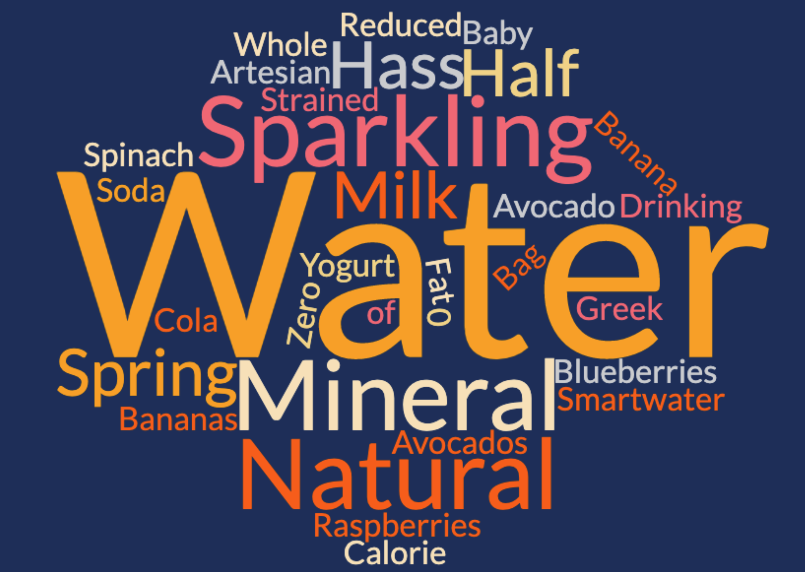
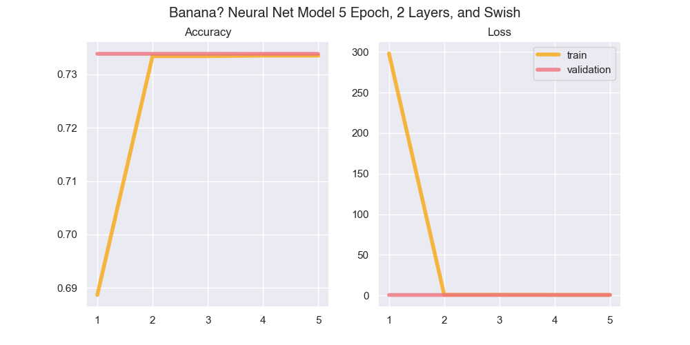

## The Data
- Instacart partners with most supermarkets, and some local speciality shops depending on your area. Once you place an order a "personal shopper" will fulfill and deliver your order to your door on the same day

- This dataset is made up of 3 million food orders from about 120,000 customers from the company spanned across multiple CSV files

## The Customer

# High Dimensional Data

### Principal Components
- The original train and test data from the Kaggle Competition has an itemized list of each users most recent order for a data frame of 200k+ orders and over 49k+ products

- To reorganize the lets look at users and the number of purchases by aisle brining it down to 134 features. PCA was used to see if we can limit the number of features even further

- Realizing that there needs to be 117 features (instead of our original 134) to account for 90% variance in the model tells us that the features are already orthogonal (or pretty close) and won't help us limit our features.

- The Curse of Dimensionality strikes again... so moving on!

# Supervised Machine Learning
### Bananas
- Can I predict if your cart has the number one ordered item - Bananas!
    - Fun fact: **58%** of users have ordered Bananas at least once
    - Fun fact: Bananas have been ordered over **500,000** times 

- Even with the information above we are dealing with imbalanced classes, only about 25% of orders have bananas

- Let’s look at the progression of accuracy and our F1 score over different models

- The above image tells me I'm predicting fairly well on whether or not your cart has a Banana. The F1 score takes into account both false positives and false negatives, which may be a better indicator of how well my model is doing with this imbalanced class

- One trick for imbalanced classes is to add more data, so let's do it!

- Let's pull in every order we have in our data set and made sure both the training and test data have the same amount of Banana and non-Banana carts (don't worry we did that in the previous examples)

- We'll also try out a Gradient Boost Model on this larger data set

- With more data, we still have imbalanced classes, but these models perform fairly close to how they did with the smaller data set.

- Our Gradient Boost Model wasn't as helpful as I thought it might be. 

# Supervised Machine Learning
### Organic
- Can I predict if your cart has an Organic item?
    - Fun fact: **10%** of products are Organic
    - Fun fact: **73%** of orders have at least 1 Organic item

- Yet again we're dealing with imbalanced classes. At least one Organic item appears in 75% of each order.

# Neural Nets
### Neural Nets for predicting if an Organic item is in your cart

### Neural Nets for predicting if a Banana is in your cart

### The Final Model
- Given all the information given by my models, the best model for predicting if a Banana is in someone’s order is Random Forest with Class Weights. Has the highest accuracy and highest F1 score.
- The best model for predicting if an Organic item is in someone’s order is Random Forest with the Best Parameters from my GridSearch. Has the highest accuracy and highest F1 score.

### Next Steps
- Adjust the imbalance in both data sets by using oversampling, undersampling, and SMOTE to see the impact on my various models

- Work with the original high dimensional data set and answer the Kaggle challenge of being able to predict if a particular item will be reordered. I would approach this problem by melting the products into features and have each user be a row.

### Credits
*"The Instacart Online Grocery Shopping Dataset 2017” Accessed from [here](https://www.instacart.com/datasets/grocery-shopping-2017) on August 20th, 2020*
