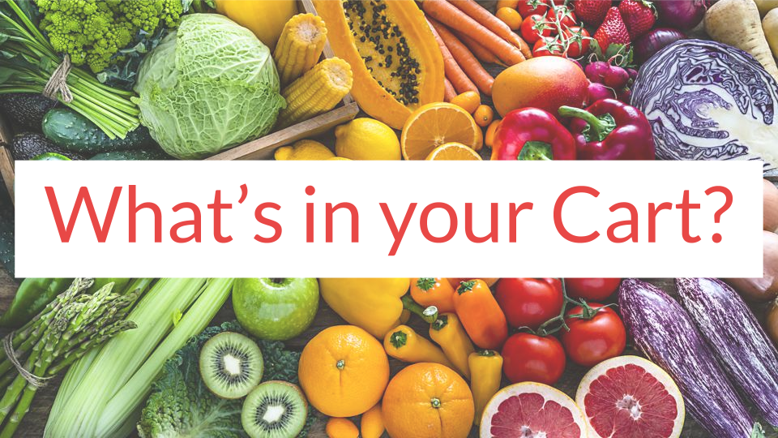
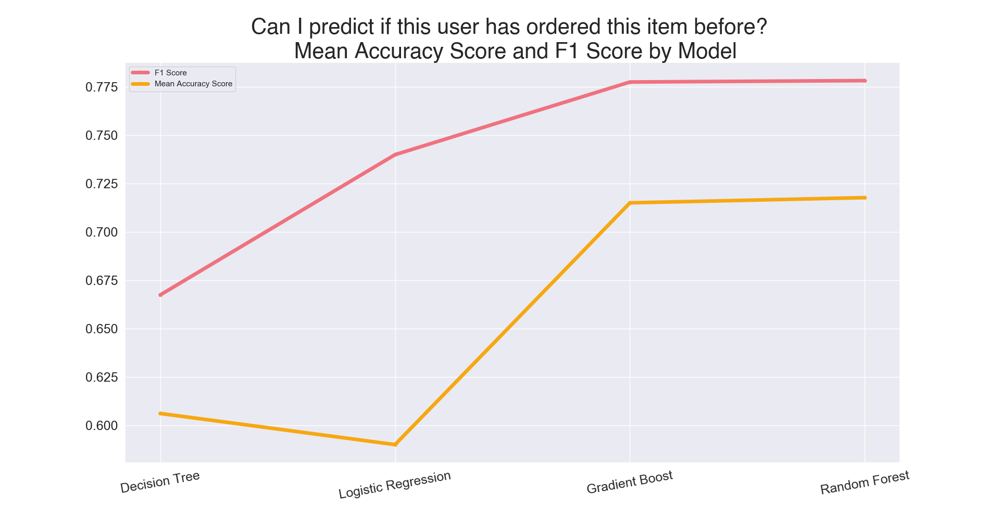
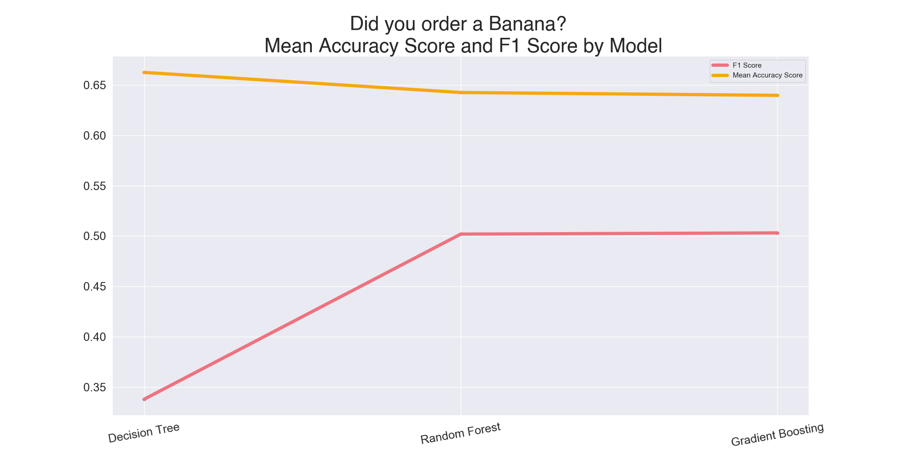

## The Data
- Instacart partners with most supermarkets, and some local specialty shops depending on your area. Once you place an order a "personal shopper" will fulfill and deliver your order to your door on the same day

- This dataset is made up of over 3 million food items orders from about 120,000 customers

- MVP: Can we determine if a customer will reorder a particular item?
- MVP: Can we increase a customers basket size through personalization?
## The Customer
###### Image below tells us customers are there for produce and value the "Organic" label

###### Date and time peaks tells us when we should ensure personal shoppers are available

###### What do customers with only 1 item order?
 

# Supervised Machine Learning on Reorders

### Has this item been ordered before?
- The original train and test data from the Kaggle Competition has an itemized list of each user's most recent order for a data frame of 200k+ orders and over 49k+ unique products. The goal is to predict if a customer will reorder an item.

- That data set creates a very sparse matrix, so it was reorganized to reflect the number of items ordered per aisle. PCA was used to see if we can limit the number of features even further. Realizing that there need to be 117 features (instead of our original 134) to account for 90% variance in the model tells us that the features are already orthogonal (or pretty close) and won't help us limit our features as much as I'd like to see.


- Next, we will go back to looking at each product and look at some feature engineering. Can we create additional features from the data we have to make a better prediction on wheater or not that particular user has ordered that specific item before? The answer is always yes...

- I organized the data frame index by combining the user and their product purchased. I brought in the number of items in the cart for that order, the day of the week, the hour, days since their previous order, and the order in which that item was added to their cart.

- I created a column to calculate the average percentage of "new" items that each user orders


- I created a column to calculate the average items in a users cart


- Three supervised machine learning models were attempted: Decision Tree, Random Forest, and Gradient Boosting with a very similar f1 score coming from the Gradient Boosting and Random Forest model. The accuracy tells me I am doing well on predicting if a user will reorder that item, the F1 scores take into account both the false negatives and false positives.


# Supervised Machine Learning
### Bananas
- Can I predict if your cart has the number one ordered item - Bananas!
    - **58%** of users have ordered Bananas at least once
    - Bananas and Organic Bananas have been ordered over **850,000** times in this data set

- Even with the information above we are dealing with imbalanced classes, so I'll need to account for that in our train test split and model parameters. I also did an oversampling technique to better balance the classes. For the various models, I will train we will look at each user, the time of day, day of the week, the number of items in cart, and days since prior order to predict if the user has a Banana in their cart.

- Let’s look at the progression of accuracy and our F1 score over different models



- The above image tells me I'm predicting fairly well on whether or not your cart has a Banana. The F1 score takes into account both false positives and false negatives, which will be a better indicator of how well my model is doing with this imbalanced class. I was surprised to see the Gradient Boost Model F1 score so low. 

### Organic
- Can I predict if your cart has an Organic item?
    - **10%** of products are Organic
    - **73%** of orders have at least 1 Organic item

- Yet again we're dealing with imbalanced classes so I'll need to account for that in the train test split and model parameters again. The image below tells me that my models are predicting Organic items with more accuracy than in the Banana models. With this train, test, split we are seeing F1 scores higher than our mean accuracy scores - which is good, in this case.


### The Best ModelS?
- Gradient Boosting provides the best metrics for all three questions. Has the customer ordered this before? Did the customer purchase Bananas? Did the customer purchase something Organic?

# Recommending Similar Items
- Word2Vec was used to recommend similar items to customers. Any item listed in the products csv can be searched to find the top 10 paired purchases. 

```
Top 10 Paired Purchases for Mango_Slices: 
 ('Yogurt_Covered_Pretzels', 0.79739),
 ('Milk_Chocolate_Pretzels', 0.68340),
 ('Wheat_Organic_Bread', 0.68032),
 ('Organic_Apple_Rings', 0.68000),
 ('Whole_Wheat_English_Muffins', 0.67952),
 ('Shelled_Pistachios', 0.67644),
 ('Small_Macintosh_Apple', 0.66885),
 ('Butter_Toasted_Peanuts', 0.65812),
 ('White_English_Muffins', 0.65385),
 ('Original_Spelt_Organic_English_Muffins', 0.65363)
```

### Slide Deck
Click [here](https://docs.google.com/presentation/d/1BBCFvZQyoPhWqSCCnT39D1kuxSmetfv1qS_6LKE_Sn4/edit#slide=id.p) for slide deck.

### Credits
*"The Instacart Online Grocery Shopping Dataset 2017” Accessed from [here](https://www.instacart.com/datasets/grocery-shopping-2017) on August 20th, 2020*
